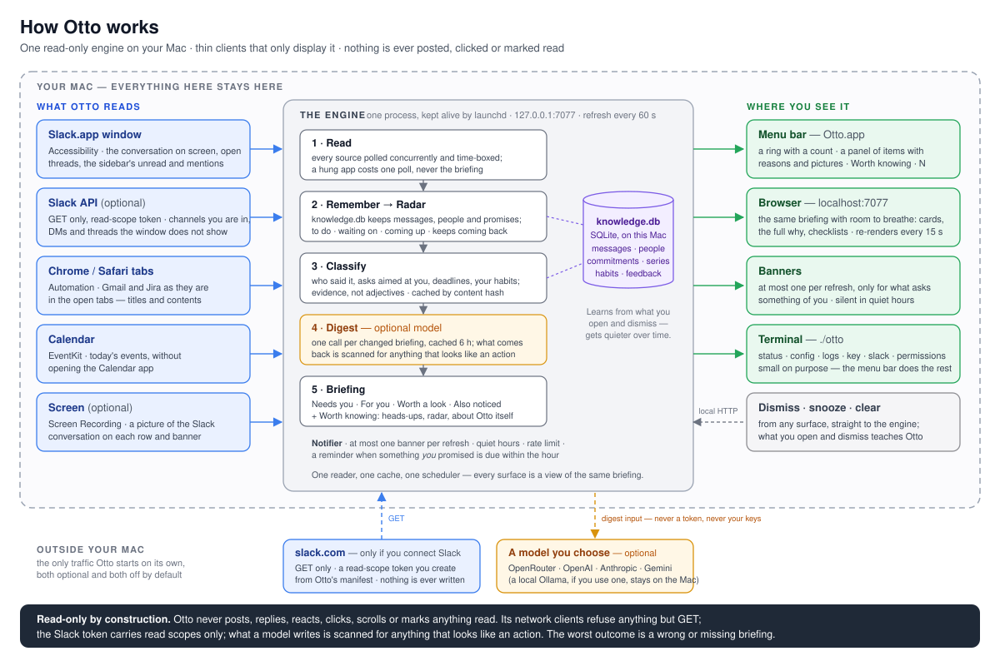

# Otto

**Otto is a personal AI assistant for your Mac that reads and never acts.**
It watches what you already have open (Slack first, plus Gmail, Jira and
your calendar) and keeps one short briefing of what actually needs you: a
small number in the menu bar, a panel with the handful of things worth your
attention and *why each one is for you*, a banner for the important ones, a
digest that ties the day together, and a radar of what you promised, what
you are waiting on and what is coming up. It remembers what it has read,
learns what you care about from what you open and dismiss, and gets quieter
as it learns.



*How it fits together. [How it works](#how-it-works) has the detail.*

## What you see

One engine in the background, four ways to look at the same briefing:

| Where | What |
|---|---|
| **Menu bar → Briefings** (`bin/Otto.app`) | Click the ring (it shows a small number when something needs you) for the panel: items grouped *Needs you · For you · Worth a look · Also noticed*, each with its reasons, a picture of the Slack conversation it came from, the digest sentence on top. Click a row to open the source at that message; click the picture to see it full size; hover for *zzz* (snooze an hour) and *✕*; right-click for more. Everything that is not a notification (anything about Otto itself that needs a look, heads-ups, what is likely next, your radar) sits behind one footer button, **Worth knowing · N**, and clears on its own. |
| **Browser** (<http://localhost:7077>) | The same briefing with room to breathe: expandable cards, the full *why*, action checklists, dismiss / snooze / clear, deep links, and the same *Worth knowing* drawer. Re-renders in place every 15 s. |
| **Banners** | At most one banner per refresh, only for things that ask something of you, with the source picture attached. Held (not dropped) when rate-limited, silent in quiet hours. Plus one reminder when something *you* promised is due within the hour or has just slipped. |
| **Terminal** (`./otto`) | Deliberately small: `status`, `config`, `logs`, `key`, `slack`, `permissions`, `install`. After setup you should not need it; the menu bar does the rest. |

Everything runs on your machine. The only network traffic Otto starts on its
own is to the model provider **you** configure (optional: without a key it
runs on local rules, or on a local Ollama if one is running) and, if you
connect Slack, `GET` requests to `slack.com`.

## Get it running (about a minute)

You need a Mac (Otto is macOS-only) and Python 3.9 or newer. `xcode-select
--install` gives you both Python and the Swift compiler for the menu bar app.
Otto is developed and tested on the current macOS; the menu bar app uses
system APIs that exist since macOS 11.

```bash
git clone <your-fork-url> Otto && cd Otto
./otto setup
```

`setup` (`scripts/setup.sh`) is safe to re-run and does only this: creates
`./.venv` and installs Otto's two runtime dependencies (`httpx`, `aiosqlite`;
plus `tomli` on Python < 3.11), optionally stores a model key, optionally
connects Slack (below), builds `bin/Otto.app` if `swiftc` is around, installs
two `launchd` agents (engine at login with auto-restart; menu bar at login),
asks macOS for the permissions below, writes `config.toml` with every setting
explained, and finishes with `./otto status`. It never touches your shell
profile. Run the script directly for its flags: `--key …`, `--no-launchd`,
`--no-menubar`, `--no-permissions`, `--no-slack`, `--dev`.

Then click the ring in the menu bar, or open <http://localhost:7077>. From
here on the menu bar is the whole interface: right-click the ring for *Edit
Config…*, *Connect Slack…*, *Add a Model Key…*, and whenever something
about Otto itself needs you (a permission, a rejected key, a typo in the
config): a line saying so with the one button that fixes it.

### The permissions it asks for

| Permission | Why | How |
|---|---|---|
| **Accessibility** | Read the Slack.app window, the primary source | Manual; macOS never prompts for this. `./otto permissions` opens the pane and shows you the exact file to add |
| **Automation → Chrome / Safari**, **Calendars** | Read tab titles and contents; today's events through EventKit | macOS prompts once each: click *Allow* |
| **Screen Recording** (optional) | The picture of the Slack conversation on each row and banner | Manual, same as Accessibility. `screenshots = false` turns it off |
| **Notifications** (menu bar app) | Native banners | macOS prompts the first time the app runs |

One thing that trips people up: because the engine runs under `launchd`,
macOS attributes what it does to the **Python interpreter**, not to your
terminal. Prompts say “python3 wants to control Google Chrome”, and the
Accessibility / Screen Recording entries must be that binary. `./otto
permissions` (also the menu bar's *Fix…*) triggers the prompts while you are
at the keyboard and names the file; the menu bar and `./otto status` say what
the *engine* can read (a terminal that can read Slack proves nothing about
the engine).

Otto never launches an app to read it. A closed Slack, Chrome or Safari shows
up as “not open” and is picked up the moment you open it (Calendar needs no
app; EventKit).

## Slack

### Without a token: what Otto reads from the window

Out of the box Otto reads Slack.app through macOS Accessibility, and it reads
all of it that is on screen: the conversation in the main window, every
popped-out conversation or thread window, and the sidebar. The sidebar is
what makes the briefing honest about what it *hasn't* read: Otto sees which
conversations Slack marks unread, which carry a mention or a DM badge, which
are muted, so under *Worth knowing* you get **Unread in Slack**: `#leads ·
mentions you`, `@alice · mentions you`, `#ops · unread`, each a click that
opens that conversation, plus one note under *Notes* when the digest has no
heads-ups of its own (“Slack shows unread in #leads, @alice, #ops, not opened
yet, so nothing from there is in this briefing”).
`./otto status` says the same in a sentence: *1 of 6 conversations read · 3
unread not opened (2 mention you)*. Open one and its messages are in the
next refresh; a conversation Otto has read stays “read” for as long as it
remembers the messages.

That is the ceiling without a token, and it is a deliberate one: Otto never
clicks, scrolls or switches channels in Slack, so the *content* of a
conversation Slack is not showing is not read: it is named, counted and one
click away instead of silently missing. Slack only publishes its
accessibility tree once an assistive client says it is there; Otto sets that
one flag on Slack's application object (the same signal VoiceOver's presence
gives) and touches nothing else; see *How it works* below.

### Connect Slack (recommended)

Connect a read-only token and Otto reads every channel, private group, DM
and thread you are in, every minute, whatever Slack happens to be displaying:
the *Unread in Slack* rows disappear because nothing is unread to Otto any
more. The token is a Slack **user token** (`xoxp-…`): it sees exactly what
you see, nothing more, and it comes from a tiny private Slack app that
exists only for you. About two minutes, once: right-click the ring →
**Connect Slack…** (or, in a terminal, `./otto slack connect`; same flow,
same code). Already have one? Paste it into `config.toml` under `[keys]`
(*Edit Config…*); same effect, no restart.

Otto opens Slack's *create an app* page in your browser with its manifest
already filled in and waits. In the browser:

1. Sign in as yourself if asked, pick your workspace, click **Create**.
2. **Install to Workspace** → **Allow** on the screen that lists what the app
   may read. (The button is on the page you land on and under *OAuth &
   Permissions*. If it says **Request to Install**, your workspace makes an
   admin approve new apps: send the request and come back when they have.)
   If the Allow window flashes and closes without finishing, reload *OAuth &
   Permissions* first: the grant usually went through and the token is
   already there. If it isn't, install from a normal tab instead of the popup:
   *Manage Distribution* → *Sharable URL* → open it → **Allow**, then back to
   *OAuth & Permissions*.
3. On **OAuth & Permissions**, under *OAuth Tokens*, copy the **User OAuth
   Token**. It starts with `xoxp-`. Not the *Bot User OAuth Token* (`xoxb-`):
   that only sees channels a bot is invited to.

Paste it into the field Otto is showing (a secure field; in the terminal it
is read with the echo off). Otto checks it with Slack (`auth.test` and one
`conversations.list` page per kind, both read-only), tells you what it can
read (“12 channels, 3 private groups, 9 DMs, 2 group DMs”), stores it in the
same 0600 key file as everything else (or the macOS Keychain if `[keys]
keychain = true` in `config.toml`), replaces any older stored Slack token, and
restarts the engine. Within a minute the badge reflects it; `./otto status`
shows what the engine is reading and any scope that was not granted.

Why a step in the browser at all? A user token is Slack's record that *you*
allowed *this app* to read on your behalf, and Slack only issues one when a
signed-in person clicks *Allow*; the token then appears on that page and
nowhere else. There is no API that hands out a user token silently, and Otto
does not work around that by lifting session cookies out of Slack.app (those
`xoxc-`/`xoxd-` tokens are refused on purpose). The link Otto opens carries
only the public manifest; nothing is created until you click. Had to sign in
first? Slack forgets the filled-in manifest on the way through sign-in: in
the terminal, press Enter with nothing pasted and the page opens again,
filled in (up to three times); in the menu bar, cancel and pick *Connect
Slack…* once more.

`./otto slack disconnect` removes a stored token (from the config file too);
to revoke it at Slack's end, open the app at api.slack.com/apps → *OAuth &
Permissions* → *Revoke All OAuth Tokens*, or remove the app from the
workspace. Treat the token like a password: it is you, read-only, in Slack.
Don't paste it into chats, issues or screenshots. Each person needs their
own; tokens cannot be shared through a team app.

### The Slack app Otto asks for

`./otto slack connect --manifest` prints the manifest for *Create New App →
From a manifest* (YAML tab), if you would rather create the app by hand. It
is the whole app: a name, nine read-only user scopes, and every optional
capability switched off: no bot user, no events, no slash commands, no
redirect URLs, nothing that could act or listen.

```yaml
display_information:
  name: Otto (read-only)
  description: Otto read only
  background_color: "#1f2933"
oauth_config:
  scopes:
    user:
      - channels:history
      - channels:read
      - groups:history
      - groups:read
      - im:history
      - im:read
      - mpim:history
      - mpim:read
      - users:read
settings:
  org_deploy_enabled: false
  socket_mode_enabled: false
  token_rotation_enabled: false
```

Other ways to store a token: `slack = "xoxp-…"` under `[keys]` in
`config.toml`, `./otto key add xoxp-…` (no guided check), or the
`SLACK_TOKEN` / `SLACK_USER_TOKEN` environment variable: the token then lives
wherever you set that variable.

What Otto does with the token, and nothing else: `GET` calls to `auth.test`,
`users.list`, `users.info`, `conversations.list`, `conversations.history`,
`conversations.replies`. The HTTP client refuses any other method at the
transport layer, so no code path can post, react, mark read or upload. It
stays within 40 calls and 25 seconds per refresh: channels active in the last
day are read every minute, quiet ones take turns. `429` / `Retry-After` is
honoured, a revoked token is reported (menu bar and `./otto status`) and
re-checked every ten minutes rather than hammered, and a missing scope
disables just that kind of conversation and says which. The token is only
ever sent to `slack.com`, never to a model provider, never over Otto's own
HTTP: the menu bar hands it to the `otto` command on a pipe. A message seen
both on screen and through the API is stored once, and links to the exact
message, because the API copy knows its permalink and the screen copy only
its channel.

With the token Otto also knows things the window cannot show: what a channel
is *for* (its purpose and topic), people's titles, who replied in a thread,
whether you did, and who reacted with 👀 or ✅, which is how a row can say
“Someone's on it” or “Reply to your question”.

## Using it

**The panel.** Left-click the ring. The top line is the digest: one
sentence on what the day adds up to. (The page adds ⇄ *connected* notes:
items that belong together, with numbered jump links in the sentence.)
Below it, the rows, and only the rows; nothing that needs nobody is mixed in
with the notifications: a coloured bar for how urgent, the title, up to three
chips saying *why it is for you*, one line in your terms, and the channel,
sender and time. Click a row and you land on **that message** in Slack (Otto
keeps the message-level link whenever any reader has seen it, screen or API,
this refresh or an earlier one; only a message no API copy ever reached opens
its channel instead). Click the thumbnail to see the conversation at full
resolution (Esc or click closes it); hover for *zzz* and *✕*; right-click for
*Open*, *Open link*, *Show where it came from*, *Snooze for an hour*, *Snooze
until tomorrow*, *Dismiss* and the full list of reasons. After the rows,
*Also noticed · N more*; then the footer: the count, **Worth knowing · N**,
the browser glyph (*Open in browser*) and *Clear*. The list has a real scroll
bar whenever there is more than fits: no hunting for an overlay that hides
itself.

**Worth knowing** is the panel's second view: a click on the footer button,
*‹ Briefings* to come back, and the panel always opens on Briefings. It holds
everything that is not a notification: first *About Otto*: ⚠︎ anything about
Otto itself that needs a person (thumbnails off because Screen Recording is
missing, a source blocked on a permission, a rejected token or key, a typo in
`config.toml`), each with the one button that fixes it; then *Notes*: ▲
heads-ups, ◇ what is likely coming next (or, when the digest has no heads-ups,
the radar's own observations); then your radar: *To do*, *Waiting on*,
*Nobody has taken this*, *Coming up*, and (without a Slack token) *Unread in
Slack*, what Slack marks unread that Otto has not seen inside, and *Keeps
coming back* for series that are late. Every note and radar row has its own ✕
on hover, and the view's *Clear* takes all of those in one click (a cleared
to-do is closed in Otto's memory too, so it does not come back); the *About
Otto* rows go when the thing is fixed. When there is nothing left it says
*Nothing more to know right now*, and the footer button disappears until
there is.

*Clear* on Briefings is one click. The items leave the briefing at once (they
stay in Otto's memory; Worth knowing is untouched), the badge drops to
nothing, and the panel settles into its quiet state: **All clear: just
keeping you up to date**, one calm line pointing at *Worth knowing* when
there is anything in it. No dialog, nothing orange. The same goes for the
page.

Right-click the ring for the menu: *Briefings*, a line on what needs you,
*Open in Browser*, *Refresh Now*, *Clear All*; then **Edit Config…** (⌘,),
**Connect Slack…**, **Add a Model Key…** (and *Fix macOS Permissions…* when
a source is blocked); then *Briefings Open In ▸ This Panel / The Browser*
(what a left-click does), *Run at Login*, *Stop Otto*, *Quit Otto Menu Bar*.
Whenever something about Otto itself needs a person (a source blocked on a
macOS permission, a Slack token that was rejected or lacks a scope, a model
key coming back 401, Screen Recording missing, a typo in `config.toml`): the
menu shows one line saying so, and *Worth knowing* lists it under *About
Otto* with the one button that fixes it (*Fix…* runs the permission
walk-through, *Connect Slack…*, *Edit Config…*, *Remove key*); the ring shows
**!** while a source is blocked (a permission, most often). The ⚙ in the
panel header is *Edit Config…* too.

**The page** (*Open in browser*, or <http://localhost:7077>) is the panel
with room: the same header (the ring with its count, *Briefings*, when it
was updated, ↻), the same headline, digest sentence and ⇄ notes, then the
same rows in the same order: *Needs you* → *For you* → *Worth a look* → *Also
noticed* (folded). A row shows its thumbnail on the right
(click it for the picture at full size); click the row for what the panel
cannot fit: *Why this is for you* spelled out, the context, the action
checklist, the link's summary, the original message at full width, and *Open
in Slack* / snooze / dismiss buttons. Hover a row for *zzz* (1 h) / *Tomorrow*
(until 8:00) / **✕**. The footer is the panel's: the count on the left,
**Worth knowing · N**, *Refresh* and *Clear* on the right, always in reach.
*Worth knowing* opens a drawer above the footer with the panel's view:
*About Otto* (the page cannot run the fix, so each ⚠︎ line says where the
button is), the notes and the radar rows (every recurring series here, with
its numbers, not only the late ones), each note and row with its ✕, and its
own *Clear*; whether the drawer is open is remembered by your browser, and
each fact appears once: the radar does not repeat what the heads-ups already
said. Dismissed items
and notes stay gone for 14 days, snoozed ones come back when the time is up;
there is no undo. Ticks on a checklist are yours, kept in the browser, not
sent anywhere. The page polls every 15 s and re-renders in place, keeping
your expanded rows, the drawer and your scroll position, and follows the
system's light or dark appearance.

**Otto learns what you care about.** Opening an item, expanding it, snoozing
it, dismissing it unread or sweeping it with *Clear* is remembered (45 days).
A channel or person you keep opening drifts up a little; one you keep
dismissing unread drifts down a little, and only a little: the nudge is
capped at 0.15, never applies to a stated severity, a directive of yours or
anything already marked as needing you, and dismissing something *after*
reading it teaches nothing. The same habits reach the model as one plain
sentence (“you usually open things from #eng; you usually skip #random”), and
when a thread grows the model is handed its own earlier read of it so the new
summary says what *changed*. `./otto status` → *Memory* shows what Otto has
so far.

**Settings** live in one file, `~/Library/Application Support/Otto/config.toml`,
written on first start with every setting and its explanation. *Edit
Config…* (menu, ⚙, ⌘,) opens it in a window of Otto's own: the file, a
*Save* button and a line underneath that tells you what the engine makes of
it. *Save* checks the file first: one that will not parse is not written and
the line names the offending line; a wrong type or a misspelt setting is
saved but pointed out; a clean save says so and the engine reloads it right
there (the port and the log level take a `./otto restart`). Prefer your own
editor? *Open in Editor* in that window, or `./otto config`. Who you are,
your standing directives, the refresh interval, quiet hours, and your keys
(`[keys]`): it is all in there; there are no flags to remember. A typo does
not take Otto down: the last good values stay in force and the menu bar
points at the line.

**The terminal**, for the few things that want one:

```text
./otto                    one-line state + help
./otto setup              the one-time setup (scripts/setup.sh)
./otto status             what's running, what it reads, which model, what needs a look
./otto config             open config.toml in your text editor (created with every setting explained)
./otto open               the page in your browser
./otto logs [-n 40] [-f]  the engine log

./otto key add <key>      a model key → 0600 file in the data dir (or the Keychain, per config.toml); no key → read from stdin
./otto key list           every key Otto found, masked, with where it lives (config.toml keys included)
./otto key remove <prefix>
./otto slack connect [--manifest] | disconnect      the read-only Slack token, same flow as the menu bar

./otto permissions        trigger and explain the macOS grants the engine needs
./otto install            run at login (engine + menu bar)      ./otto uninstall [--keep-menubar]
./otto start / stop / restart
```

Anything a key or token changes takes effect right away: `key add`, `key
remove` and `slack connect` restart a running engine for you, and a key
typed into `config.toml` is picked up within a minute. `./otto status` ends
with **Needs a look**: the same list the menu bar shows, each line with the
command that deals with it, or *Nothing needs a look.*

## A model is optional

A key from **OpenRouter** (`sk-or-…`), **OpenAI** (`sk-…`), **Anthropic**
(`sk-ant-…`), **Gemini** (`AIza…`) or **Devin** (`apk_user_…`) turns on the
written summaries, the one-line *why this matters to you*, the digest at the
top, and better ranking. With no cloud key, a running **Ollama**
(`localhost:11434`) is used automatically; with nothing at all, everything
below still works on local signals. Keys are found in this order: environment
(`OTTO_API_KEY`, `OPENROUTER_API_KEY`, `OPENAI_API_KEY`, `ANTHROPIC_API_KEY`,
`GEMINI_API_KEY`, `DEVIN_API_KEY`) → `[keys] model = [...]` in `config.toml`
→ macOS Keychain → `~/Library/Application Support/Otto/api.key` (both files
mode 0600). Paste a key into the config file and it is in use within a
minute; `./otto key list` shows every key, masked, with where it came from.
A checkout never contains a key: the data dir is outside it, and `*.key` and
`.env*` are ignored.

Otto is frugal with the model and honest about it. Verdicts are cached by
content hash and persisted, so restarts do not re-spend tokens; at most 12
conversations go to the model per refresh (3 at a time, most urgent first);
the digest costs one call per *changed* briefing and is cached for six
hours; text is stripped of e-mail addresses, phone numbers, card and ID
numbers, IP and street addresses before it leaves, and scrubbed for prompt
injection; and there are daily token and cost budgets (`[llm]`). A dead
model id rotates to the next known one; a rejected key or an exhausted quota
parks that provider for six hours (remembered across restarts, forgotten on
`./otto restart` or a new key). Nothing on the page or in the panel says
“AI”: the words are just the words; `./otto status` tells you which model,
if any, wrote them and why one is out of action, and a rejected key shows up
in the menu bar with a *Remove key* button (or *Edit Config…* when the key
lives in `config.toml`). Adding a key is *Add a Model Key…* in the menu (or
`./otto key add`); it goes to the `otto` command on a pipe, never over HTTP,
and is stored 0600 outside the repo. Or type it into `[keys]` in the config
file, same place the Slack token goes.

## How Otto decides what matters

For every conversation Otto scores **urgency** (soon?), **importance** (at
all?) and **opportunity** (a tool, paper or decision worth knowing about?)
from local signals: asks and mentions aimed at you, questions, deadlines,
incident and severity words, your standing directives, your `[user] focus`,
who wrote it, and lets the model refine, never gate. Two floors hold
whatever the words score: an ask aimed at you lands under *Needs you*
(urgency at least 0.7), and a DM, a mention or an answer to a question of
yours is at least *For you* (0.5) unless the newest message is yours or a
bot's all-clear. Urgency puts items into groups: *Needs you* at 0.7 and
above, *For you* from 0.3, *Worth a look* for things whose only merit is an
opportunity, *Also noticed* for the rest. Threads stay threads: a reply in Slack's thread
panel joins its parent. Duplicates across sources merge.

The output is deliberately small: one headline (“3 items needing your
attention · 2 other updates”) with a tally of *why* under it, the digest, the
groups, one line per item until you open it, and “All clear: just keeping
you up to date” when that is the truth. Quiet is the intended steady state,
and it looks like one: no digest written about things you have since cleared,
nothing orange; what is still worth knowing waits behind its own button.

### Why this is for you: evidence, not adjectives

Every row has to answer “why am I looking at this?” with something you can
check. The chips are computed from the data, never asserted by the model; the
four strongest are kept, with implied ones dropped (an ask implies the
mention, a reply implies the thread):

| Chip | What it proves |
|---|---|
| **Asked of you** · **Mentions you** · **Direct message** | The newest message names you, asks you something, or is a DM, with the due date if one was given |
| **Reply to your question** · **New reply in your thread** · **Your message** | You asked and somebody answered (who, how long after); you wrote in this thread; or the newest message is yours, which is why it sits in the fold |
| **Someone's on it** | Somebody reacted 👀 / ✅ / 🙋 to an ask: picked up, not necessarily done, so it sits under *For you* rather than *Needs you* |
| **Your directive** | It matches one of your `[user] directives` in `config.toml`; the tooltip shows which |
| **Your focus: …** | It names something you listed under `[user] focus` |
| **4 critical · 2 high** · **CVSS 9.8** | A severity stated in the message itself |
| **Due tomorrow 5 PM** · **Overdue 2 h** · **alice promised** | A deadline or promise in the text, resolved to a real time |
| **Opportunity · tool worth a look** | Not urgent, but worth knowing: it gets *Worth a look* instead of the fold |
| **alice · Staff Engineer** · **alice · 12 messages this week** · **First message from carol** | Who it is from: their Slack title (with a token), how often you hear from them, whether Otto has seen them before |

The sentence after the chips is the model's, written to *you* from the same
evidence plus your role and focus if you set them, plus (with a Slack token)
the channel's purpose and the people's titles:

```toml
[user]
name = "Alex Kim"                                   # as Slack shows it (learned automatically when possible)
aliases = ["alex", "akim"]
role = "security engineer on the platform team"     # one line
focus = ["runner image", "billing", "sandbox"]      # things you own or watch → "Your focus: …"
```

Without a key, a focus hit still lifts an item into *For you* with its reason.
Banners lead with the same reasons. Everything the model writes is addressed
to you: the prompt asks for the second person and any “the user …” that
slips through is rewritten, so a card never talks about you in the third
person.

### Who said it

Otto keeps one registry of your names (`[user] name` and `aliases`, the name
next to Slack's “(you)” marker, and `auth.test` when a token is configured)
and reads a conversation differently depending on who wrote the newest
message. A bot's routine notice, a colleague's ask and your own reply are not
the same thing: a conversation whose newest message is *yours* is capped low
(0.35) unless a directive or a real severity is in play, because the briefing
reports what *others* did; every line the model sees names its author with a
`(you)` or `(bot)` marker; and a two-word message from a person is kept where
the same two words from an unknown source are treated as interface noise.

### The digest

The digest is the one place the model looks at the *whole* briefing rather
than one conversation: the visible items (never the dismissed or snoozed
ones) with their chips and *for you* lines, plus the radar rows. It comes
back as one sentence, ⇄ connections between items (each checked against the
briefing; a reference to an item that is not there is dropped), ◇
predictions with their basis, and ▲ heads-ups; anything that reads like an
instruction to act is thrown away. It is cached for six hours on a fingerprint
of its input, so a quiet hour costs nothing and a briefing that changed costs
one call; a slow or failed call falls back to the same facts in plainer
words. A digest remembers how many items it was written about; once those
are cleared it is stale and disappears, so the quiet state never carries a
sentence about things that are gone.

## Memory and radar

Every message Otto reads is remembered once in `knowledge.db` (SQLite, mode
0600, in the data dir; 90 days / 100 000 messages), keyed so that the
screen's “review PR 7” and the API's “review PR 7 (https://…)” are one
message. Memory is what gives the model “earlier in this channel” and “what
this person said elsewhere this week”, and what keeps the briefing
**steady**: it is built from everything read inside `lookback_hours` (default
24), not from whatever is on screen this minute, so nothing flickers as you
switch windows, and a dismissal made while a message was on screen still
holds when it is recalled (recalled messages hit the same classification
cache; recalling costs no model calls). A corrupt database is set aside as
`knowledge.db.corrupt-<time>`, never deleted, and a fresh one starts.

**Radar** is rebuilt from memory every refresh and shown under *Worth
knowing* in the panel and on the page, never among the notifications:

| Section | What lands there |
|---|---|
| **To do** | Things *you* said you would do and asks aimed at you, due dates resolved relative to when they were said (“by Friday” said on Saturday means next Friday; questions are never deadlines) |
| **Waiting on** | Promises other people made that have not been followed up |
| **Nobody has taken this** | Open calls (“can someone look at the flaky test?”) nobody answered |
| **Coming up** | Dated events and deadlines mentioned anywhere |
| **Keeps coming back** | Recurring things (a daily scan, a weekly report): their rhythm, when the next is expected, whether it is late; numbers in them trended; channels much busier or quieter than usual |
| **Unread in Slack** | Without a token: conversations Slack marks unread or with a mention that Otto has not seen inside |

Rows close themselves: a promise disappears when its owner says it is done
(overlapping words), dated items expire once past (three days after a due
date, ten for undated ones, six hours after an event starts), ✕ or *Clear*
in *Worth knowing* keeps one gone (a heads-up or prediction dismissed there
stays away for 14 days by its wording). Reminders are quiet: one banner
when something *you* own is due within the hour or has just slipped, once
per item, under the normal notification rules.

## Configuration

One file: `~/Library/Application Support/Otto/config.toml`, mode 0600 (it may
hold your keys). The engine writes it on first start with every setting
present and explained (a `#` comment per key), so opening it is the
documentation; a file from an older Otto gets any setting it lacks added on
open, in place, comments untouched. *Edit Config…* in the menu bar (or ⚙ in
the panel, ⌘,) opens it in Otto's own editor window: *Save* validates and
the engine reloads at once; `./otto config` opens it in your text editor
instead, and then changes are picked up within a minute. Either way `port`
and the log settings take `./otto restart`. A file that does not parse is
not saved by the editor and, if it got there some other way, is reported:
menu bar, page and `./otto status` name the line, with the last good
values staying in force; a misspelt key is reported and ignored. The keys,
with their defaults:

```toml
log_level = "INFO"        # DEBUG, INFO, WARNING or ERROR for otto.log (restart to apply)
debug_mode = false        # same as log_level = "DEBUG"

[user]
name = ""                 # your display name as Slack shows it (learned automatically when possible)
aliases = []              # handles and nicknames people use for you
role = ""                 # one line, e.g. "security engineer on the platform team"
focus = []                # projects, systems or topics you own → "Your focus: …"
directives = []           # standing rules in your own words, checked against every item

[engine]
refresh_seconds = 60      # how often everything is re-read (at least 15)
port = 7077               # loopback-only port for the page and the menu bar (restart to apply)
screenshots = true        # pictures of the Slack window on items and banners (needs Screen Recording; Slack is never focused)
lookback_hours = 24       # how far back each refresh looks, 1 to 168
recall = true             # also show remembered messages inside that window, not only what is on screen right now

[notifications]
urgency_threshold = 0.8           # only items at or above this urgency (0 to 1) become a banner
max_per_hour = 5                  # the rest wait for the next hour
quiet_hours_start = "23:00"       # local time
quiet_hours_end = "07:00"
critical_bypass_threshold = 0.95  # urgency that may interrupt quiet hours

[keys]
slack = ""                # read-only Slack user token, "xoxp-…" (Connect Slack… walks you through getting one)
model = []                # model keys, any of: ["sk-or-v1-…"] OpenRouter · "sk-…" OpenAI · "sk-ant-…" Anthropic · "AIza…" Gemini
keychain = false          # keys added from the menu bar or `otto key add` go to the macOS Keychain instead of api.key

[llm]
daily_token_limit = 500000        # past either limit the day runs on local signals
daily_cost_limit_usd = 2.0        # an estimate from token counts

[links]
fetch = false             # download titles and READMEs of links people share (public hosts only)

[debug]
dump_extracts = false     # write what was read from each app and tab to <data dir>/debug/ (last 20)
```

Environment overrides for one-off runs: `OTTO_PORT`, `OTTO_REFRESH_SECONDS`,
`OTTO_DATA_DIR`, `OTTO_DISABLE_SCREENSHOTS=1`, `OTTO_DISABLE_RECALL=1`,
`OTTO_LINK_FETCH=1`, `OTTO_DUMP_EXTRACTS=1`, `OTTO_DEBUG=1`, `OTTO_NATIVE_AX=0`
(fall back to the slow AppleScript walk of Slack.app), `OTTO_PYTHON` (which
interpreter the `./otto` wrapper uses). The running engine writes
`engine.json` (its pid and port) next to the config so the command and the
menu bar find it wherever `port` put it.

All state lives in `~/Library/Application Support/Otto/`: `config.toml`,
`api.key`, `otto.log` (plus `launchd.out.log` / `launchd.err.log` from
launchd), `knowledge.db` (messages, radar, what you opened and dismissed),
`history/` (72 h of conversation context), `screenshots/` (pruned: 40 files /
3 days), `debug/` (only with `dump_extracts`), `dismissed.json`,
`snoozed.json`, `notified.json`, `classification_cache.json`,
`synthesis_cache.json`, `link_cache.json`, `provider_health.json`,
`state_checkpoint.json` (what a restart resumes from), `engine.json` and
`otto.pid` (the running engine). JSON files are written atomically. Deleting
the folder resets Otto; `./otto uninstall` leaves it alone. The menu bar app
keeps one preference of its own (where *Briefings* opens) in `UserDefaults`.

## How it works

### One engine, thin clients

```text
                      launchd (RunAtLoad, KeepAlive)
                                 │
                                 ▼
                     ┌───────────────────────────┐
                     │  otto.core.engine.OttoEngine  (one process)
                     │                           │
                     │  refresh loop  ── every 60 s ──►  collect_briefing_data()
                     │      │                    │         ├─ poll adapters concurrently (time-boxed)
                     │      │                    │         ├─ normalise + dedupe
                     │      │                    │         ├─ remember (knowledge.db) → radar (commitments, trends)
                     │      │                    │         ├─ classify (content-hash cache → model only for new,
                     │      │                    │         │            with "earlier in this channel" from memory,
                     │      │                    │         │            your habits, and Otto's earlier read of the thread)
                     │      │                    │         ├─ digest (one call per *changed* briefing, cached)
                     │      │                    │         └─ briefing JSON  → BriefingData (in memory)
                     │      ▼                    │
                     │  Notifier ── ≤1 banner/refresh, quiet hours, rate limit, persisted dedupe;
                     │              radar reminders for what *you* own (due < 1 h / just slipped)
                     │                           │
                     │  ThreadingHTTPServer 127.0.0.1:7077
                     └──────┬──────────┬─────────┴──────────┐
                            │          │                    │
                    browser UI     menu bar app (Swift)    `otto` CLI (small)
                 GET /briefing    GET /api/items (panel)   GET /api/status (status, problems)
                 POST /api/…      GET /api/status (+problems)   POST /api/refresh (permissions)
                                  GET /api/notifications   config.toml ← `otto config`
                                  POST /api/notifications/ack, /api/feedback, /api/dismiss,
                                       /api/snooze, /api/clear
                                  runs `otto …` for set-up: permissions, restart,
                                       `config --json` / `config --save --json` (the file on stdin),
                                       `slack connect --json` / `key add --json` (secret on stdin)
```

There is exactly one reader, one cache and one scheduler; every surface is a
view of the same in-memory briefing and is at most `refresh_seconds` stale.
The menu bar app holds no ranking logic and no data of its own: its panel
renders `/api/items`: items already grouped, every URL already checked, the
thumbnail resolved to a file, and its menu, banners and *needs a look* lines
come from `/api/status` and `/api/notifications`. Set-up flows run the `otto`
command with the secret (or the whole config file) on stdin, so nothing
sensitive ever travels over HTTP or in a command line. The menu bar app can
also render itself without an engine, for checking: `--preview items.json
out.png` draws the panel (`--worth-knowing` its second view), `--preview-config
file.toml out.png` the config editor, `--icon out.png` the glyph in each of
its states.

### The refresh loop

* **Every source is time-boxed** (15 s to connect, 40 s to poll). A hung
  Slack read costs one refresh of Slack, not the briefing.
* **Per-source health, not a global error.** Every poll produces a status
  (`ok` / `failed` / `timeout` / `backoff`, an explained error, item count).
  A source blocked on a macOS permission is retried after 2, 4, 8 … minutes
  (capped at 15) so the engine does not re-trigger the permission dialog
  every minute; “app not open” is never backed off. The page, `./otto status`
  and the menu bar all read the same list, so you are told *which* source is
  unreadable and why rather than shown an “All clear” that is not true.
* **“Needs a look” is computed once, by the engine**: a source blocked on a
  permission, a Slack token rejected or missing a scope, a model key
  answering 401/403, Screen Recording missing, `config.toml` not parsing or
  carrying an unknown key, the menu bar app installed but silent. Each comes
  with its one action, which the menu bar turns into a button and `./otto
  status` into a command.
* **Failures back off** (60 → 120 → … ≤ 600 s) and snap back on success;
  *Refresh Now* wakes the loop; a long gap between ticks (sleep) triggers an
  immediate refresh on wake.
* **Nothing blocks the collector.** Every adapter runs its subprocesses
  asynchronously with a time-box; tab enumeration is done once per refresh
  and shared; the Slack.app read and the Slack tab reads run concurrently.
  The local reads take a couple of seconds; the Slack API reader (up to 25 s)
  and the model calls are what make a refresh longer. The phase timings
  (`poll`, `memory`, `classify`, `screenshots`, `build`, `save`) plus each
  source's seconds ride along in `/api/status`, so `./otto status` can say
  “slack took 27 s, mostly tabs” instead of “slow”.
* **Last lines of defence.** One whole refresh is bounded at 180 s; a
  refresh still “running” after ten minutes makes the engine exit with code
  3, and `launchd` restarts it within seconds with all state on disk. A bug
  while rendering one request answers with a short 500 (or JSON for
  `/api/*`) and the engine keeps serving.
* **Thumbnails have a budget and a subject.** At most one `screencapture`
  per refresh, only while the Slack window is showing the conversation the
  item belongs to (a picture of `#eng` is never filed as `#ops`), never by
  bringing Slack forward. Screen Recording is checked without prompting; a
  missing grant, a failed or a blank capture pauses pictures for 30 minutes
  and says so.
* **Housekeeping** every refresh: screenshot pruning, expired snoozes,
  dismissals older than 14 days, notification dedupe records.

### Reading Slack.app

Slack.app is read natively, in Python: `adapters/browser/ax_dump.py` walks
the window's Accessibility tree with ctypes, bounded by node count,
characters, a wall-clock deadline and a per-message timeout, and returns the
visible text in document order (~0.2 to 0.5 s, where the AppleScript walk it
replaced took 10 to 60 s). It runs as a child process of the engine under the
engine's own interpreter, which is what makes the one Accessibility grant
cover it. Its exit codes are a contract: 0 text, 1 app closed / no window, 2
not trusted, and 2 is definitive, so a denied read never falls through to a
prompt.

Slack has to be told someone is listening. Electron apps publish their
accessibility tree only once an assistive client announces itself; until then
Slack's window is a title bar and about a dozen nodes, and read-only querying,
however deep, does not change that. So the reader does the one thing it
ever tells an app: when the main window looks like chrome only, it sets
Electron's documented `AXManualAccessibility` flag to true on Slack's
*application* element and waits up to 5 s for the tree to appear. That flag
means “an assistive client is here”, the same thing VoiceOver's presence
means, and nothing else: it is the only setter bound in the file, written
only when currently false, only on the application element, never
`AXEnhancedUserInterface` (which changes window behaviour), never an
attribute of any UI element, never an action. A test pins exactly that one
call.

With the tree up, `ax_dump --json` returns every Slack window (the main one
first, then popped-out conversations and threads) and the sidebar as data:
Slack's own CSS classes ride along in the tree, so each sidebar row yields
its name, section (*Starred*, *Channels*, *Direct Messages*, *Agents & apps*),
unread, badge, selected, muted, whether it is a DM and whether it is you. Day
dividers carry no text in the tree, so the reader emits each message's full
time (“Sep 7th at 10:47:28 AM”), which is how a DM scrolled back a week is
dated correctly instead of resurfacing as new every morning. One parser
(`utils/content_parser.py`) turns both the Slack.app tree and the web
client's page text into messages with real timestamps, drops interface
chrome by pattern, files thread-panel replies under their parent, and keeps
one id per message while Slack re-renders “Just now” into “7:15 PM”.

### The Slack API reader

The optional API reader (`adapters/slack.py`) persists across refreshes
because it carries state worth keeping: the channel and user directories,
when each channel was last read, which channels are “hot”, any rate-limit
back-off, and it plans its reads: directories only when their TTLs expire
(15 min / 1 h); never-read channels first; channels with a message in the
last day every time; quiet ones round-robin with a quarter of the budget
reserved for them; threads whose latest reply moved (≤ 10 per poll); unknown
senders (≤ 8). Hard caps: 40 calls, 25 s. A `429` sets `Retry-After` back-off
and the poll returns what it has; a missing scope disables just that kind of
conversation; an auth error ends the poll at that call: nothing else goes
out, and parks the reader for ten minutes with the reason in the status,
after which one `auth.test` decides whether to resume. It renders Slack's
markup (`<@U…>` → `@Name`, `<#C…|eng>` → `#eng`) and lifts bot content out of
attachments, so downstream code sees the same shape the screen readers
produce. The read-only guarantee is structural: its HTTP client has an empty
write allowlist, so any non-`GET` is refused by the transport (a test proves
it with a real client), and the class has no method whose name or body could
write.

### Banners

The banner path is pull-based: the engine queues at most one banner per
refresh; the menu bar app pulls every 15 s, shows it natively with the source
picture attached, and acknowledges it. When no client has pulled for five
minutes (menu bar quit or not built), banners older than 90 s are posted by
the engine itself (through the app's `--notify` mode when the bundle exists,
else `osascript … display notification`), so banners never depend on the menu
bar being up. Several new items at once collapse into one banner (“+N
more”); dedupe is persisted, so a restart does not replay yesterday.

### Staying up

`launchd` restarts the engine on crash (`KeepAlive`, ten-second throttle); a
clean stop joins the server thread and flushes state. A second agent opens
the menu bar app at login and brings it back within about ten seconds if it
ever crashes; *Quit* exits cleanly and therefore sticks until the next login,
and *Run at Login* in the menu removes only the engine agent (`otto uninstall
--keep-menubar`), so it cannot kill the menu it lives in. An installed but
silent menu bar app is a *needs a look* line. Re-installing waits for the old
job to unload before loading the new one: `launchd` silently drops a load
issued while the old job is still tearing down.

## Where this stands

Otto is an experimental, working personal tool, not a product. It runs on
one Mac for one person, reads apps through their accessibility and scripting
interfaces (which Apple and Slack change without notice), and judges
relevance with local rules plus an optional model, so expect the odd miss or
strange ranking. File formats and config keys may still change.

It is read-only by construction. Otto never posts, replies, reacts, clicks,
scrolls, marks anything read or changes anything in the apps it reads.
Every network client it owns refuses anything but `GET` at the transport
layer; the Slack token it asks for carries read scopes only; what the model
writes is scanned for anything that looks like an action; the menu bar app
only opens links, talks to the engine on your own Mac and runs Otto's own
command. The worst thing that can go wrong is a wrong or missing briefing.
The table below is that guarantee, threat by threat.

For context, Otto was vibe coded: written with an AI coding assistant,
directed and reviewed by one person, iterating on the running app rather
than on a design document. The read-only guarantees are enforced in code and
covered by the test suite, not by intent alone.

## Security

| Threat | Mitigation |
|---|---|
| Otto doing something on your behalf | A write guard wraps every outbound HTTP client and blocks non-`GET` methods to non-allowlisted hosts at the transport (the Slack reader's allowlist is empty); model output is scanned for write intent; the digest's item references are checked against the briefing; the Accessibility reader binds no action API and its one setter is pinned to the one flag above; every `tell application` is gated on the app already running; the menu bar app only opens URLs, talks to loopback and runs the `otto` command |
| A Slack token used for more than reading | Read scopes only; `GET` only; only the six read methods are called; the token goes to `slack.com` alone and is excluded from model-provider detection; `otto slack connect` opens the browser on one fixed URL only (Slack's own create-app page carrying nothing but the public manifest), never with your input in the URL; it reads the token with echo off (or in the menu bar's secure field, handed to the command on stdin), verifies it over the same `GET`-only client, and refuses `xoxc-`/`xoxd-` session tokens. Slack issues a user token only after a signed-in person clicks *Allow*; Otto does not go around that |
| A secret on the wire | Keys and tokens collected by the menu bar never travel over HTTP or argv: the app pipes them to the `otto` command's stdin (`key add --json`, `slack connect --json`), which stores them 0600 and answers with one masked JSON line; the config editor moves the whole file the same way, since `[keys]` may hold keys |
| Secrets in git | Keys in the Keychain, the 0600 `api.key`, or `[keys]` in the 0600 `config.toml`, all in the data dir, outside the checkout; `*.key`, `.env*` and `bin/` are git-ignored; CI scans the tree for key shapes |
| Another site scripting the local server (DNS rebinding, CSRF) | Bind `127.0.0.1` only; `Host` allowlist → 400; mutations are `POST` only and require same-origin `Origin`/`Referer`/`Sec-Fetch-Site` (native clients with no such headers are allowed) → 403; 64 KB body cap |
| XSS from message content | All text HTML-escaped; CSP `default-src 'none'; script-src 'nonce-…'; style-src 'nonce-…'` with a per-response nonce; no inline handlers or styles |
| `javascript:` / `file:` links from content | URL scheme allowlist (`http`, `https`, `slack`, `ical`) applied before rendering |
| Serving arbitrary files | Only `*.png` from the screenshots directory; the path is normalised and checked |
| SSRF via link enrichment | Off by default; when on: public hosts only (resolves and rejects private, loopback and link-local addresses), 4 s, 256 KB |
| Memory leaking what you have read | `knowledge.db` is 0600, local, pruned at 90 days; its contents reach the network only as model context for conversations being analysed, under the provider you chose, redacted as above |
| Otto reading more than it should | Reads are bounded; nothing is read from an app that is not already open; no app is ever launched, focused or navigated; only what Slack has on screen is read without a token |
| Tests touching your data or desktop | The suite redirects every path into a temp dir and blocks `osascript`, `open`, `launchctl`, `screencapture`, `security`, `pkill`, `pgrep`, `lsof`, the Accessibility reader and friends |

**What leaves your Mac.** Nothing, unless you configure it: with a model key,
the message text needed to classify a conversation plus a bounded slice of
earlier context from memory, redacted of e-mail addresses, phone numbers,
card and ID numbers, IP and street addresses; with a Slack token, `GET`
requests to `slack.com`; with `[links] fetch = true`, `GET` requests for the
titles of public links people shared. `otto slack connect` also hands your
browser one `api.slack.com` link carrying the public manifest; Otto itself
sends nothing in that step.

## Limitations

* **macOS only, one user, one Mac.** No Windows/Linux, no remote access: the
  server binds loopback and has no authentication because it never listens
  anywhere else.
* **It reads what the apps show, unless you connect Slack.** Without a token
  Otto reads every Slack window that is open and knows from the sidebar
  which conversations are unread or mention you, but it never clicks, so
  what is *in* a conversation Slack is not showing stays unread until you
  open it (the briefing says so: *Unread in Slack*). Slack's sidebar is a
  virtual list, so only the part of it that is rendered is seen, and it
  shows that a conversation has a badge, not the number on it. Gmail and
  Jira come from open browser tabs (a closed tab is not read), and Chrome
  gives tab titles only until you enable *View → Developer → Allow JavaScript
  from Apple Events* (Safari falls back to the page source). Calendar comes
  from EventKit (today's events) or a Google Calendar tab.
* **Slack gets the deep treatment; the rest is shallower.** Threads,
  reactions, titles, purposes, pictures and most radar signals are Slack
  features; the other sources contribute items and calendar context.
* **English.** Deadlines (“by Friday EOD”), promises (“I'll…”), asks and
  severity words are recognised in English.
* **Judgement is probabilistic.** Rules and models misrank things; the chips
  tell you what Otto actually verified so you can tell a good reason from a
  weak one. Model text is normalised to address you directly, but it is
  still model text. Habits move scores by at most 0.15 and never past a hard
  signal.
* **No undo** for dismiss, snooze or clear, and no sync: dismissals live in
  one data dir on one machine.
* **Not sandboxed or signed.** The menu bar app is built locally from
  `src/otto/menubar/` and is not notarised; the engine is a plain Python
  interpreter (the one `.venv` points at), which is why the permission grants
  name `python3` rather than “Otto”.
* **Scaffolding in the tree.** `src/otto` still contains modules from earlier
  designs that the engine no longer runs (`intelligence/{patterns,
  correlator, drift, failure_journal, opportunity, people, temporal}.py`,
  `storage/`, `safety/scope_validator.py`, `ui/`, the API adapters for
  Gmail/Jira/Calendar, `briefings/`, `onboarding/`, `core/{backend,
  supervisor, shutdown}.py`, `utils/{credentials, retry, time}.py`). They
  have tests but no effect on the briefing.

## Development

```bash
./scripts/setup.sh --dev --no-launchd --no-permissions --no-slack
.venv/bin/python -m pytest -q          # ~1450 tests, ~40 s, hermetic (no desktop, no real data)
.venv/bin/ruff check src tests
scripts/build_menubar.sh               # rebuild bin/Otto.app after editing the Swift
bin/Otto.app/Contents/MacOS/OttoMenuBar --preview items.json out.png [--dark]   # render the panel offscreen from an /api/items payload
bin/Otto.app/Contents/MacOS/OttoMenuBar --preview items.json out.png --dismiss-first   # …after dismissing the first row mid-render (crash regression)
bin/Otto.app/Contents/MacOS/OttoMenuBar --preview items.json out.png --worth-knowing [--clear]   # the Worth knowing view (and after its Clear)
bin/Otto.app/Contents/MacOS/OttoMenuBar --preview-config file.toml out.png [--dark] [--error "…"] [--unknown a.b,c]   # the Edit Config… window, offscreen
bin/Otto.app/Contents/MacOS/OttoMenuBar --icon out.png                          # the menu bar glyph in every state, light and dark
.venv/bin/python src/otto/adapters/browser/ax_dump.py Slack --json              # what the engine reads from Slack.app: windows + sidebar (needs Accessibility for that python)
```

CI (`.github/workflows/ci.yml`) runs the suite on macOS with Python 3.9 and
3.12, builds the menu bar app, and fails if a key-shaped string or a
`*.key` / `.env` file is in the tree.

Layout of what actually runs:

```text
otto                            wrapper: picks .venv or python3, runs `python -m otto`
src/otto/cli.py                 the `otto` command
src/otto/core/engine.py         the one process: HTTP server + refresh loop + notifier + watchdog
src/otto/core/launchd.py        the two LaunchAgents (install/uninstall/status)
src/otto/core/notify.py         banner policy, dedupe, quiet hours, menu-bar pull + fallback
src/otto/core/health.py         "needs a look": the engine's problem list with the one action each (menu bar, page, status)
src/otto/core/slack_connect.py  `otto slack connect|disconnect` (+ the menu bar's --json flow), the app manifest
src/otto/config.py              config.toml: defaults, the commented template, validation, hot reload, the editor's load/save
src/otto/utils/keys.py          where keys live: env, config.toml [keys], Keychain, api.key
src/otto/web/collect.py         refresh pipeline: adapters → dedupe → memory → classify (cached) → digest → briefing JSON
src/otto/web/items.py           the panel payload (/api/items)
src/otto/web/render.py          HTML/CSS/JS of the page (CSP nonce, no inline handlers)
src/otto/web/server.py          routes + security policy       src/otto/web/security.py  Host/origin/CSP/URL checks
src/otto/adapters/browser/      Slack.app (ax_dump.py, reader.py, slack_browser.py), Slack/Gmail/Jira tabs, Calendar (EventKit)
src/otto/adapters/slack.py      the optional Slack Web API reader (GET-only)
src/otto/intelligence/          classifier, relevance (why chips), knowledge (memory + habits), radar, commitments, trends, synthesis (digest)
src/otto/llm/                   gateway (providers, failover, budgets), prompts, injection defence, write-intent scan
src/otto/utils/pii_redactor.py  what is stripped before text reaches a model
src/otto/safety/write_guard.py  the transport that makes "read-only" structural
src/otto/menubar/               Swift menu bar app (panel, banners, config editor) + find_window helper       scripts/build_menubar.sh
scripts/setup.sh                one-command install
```

The engine's JSON API on loopback: `GET /api/status`, `/api/briefing`,
`/api/items` (the panel payload), `/api/notifications` (`?peek=1` to look
without counting as a client); `POST /api/refresh`, `/api/dismiss`,
`/api/snooze`, `/api/clear` (`scope=notes` clears Worth knowing instead of
the items), `/api/feedback` (`kind=open|expand`),
`/api/notifications/ack`, `/api/notifications/test` (queues one banner that
says banners work, nothing else).

Principles the briefing is held to:

1. **Silence is a feature.** “All clear” is the intended steady state. Every
   element on the page has to earn its place by changing a decision.
2. **One glance, then one click.** Headline → group → card → deep link.
   Never more than one line per card unless you expand it.
3. **Never ask twice.** Dismissed and snoozed items stay gone; notifications
   are deduplicated across refreshes and restarts.
4. **Prefer local signal.** Mentions, questions, deadlines, incidents,
   standing directives. The model refines; it does not gate.
5. **Fail soft.** Any subsystem may fail; the briefing still renders with
   whatever was collected and says how old it is.
6. **Evidence, not adjectives.** A card may not say “important” without
   showing why *for you*: the chips are computed from the data, the model's
   sentence is built on them, and the header tallies them. If Otto cannot
   name a reason, the item is quiet by design.

Ideas worth building next: closing an ask of you automatically when your
own reply lands after it; calendar-aware urgency (“needs you before your 2 pm”);
batching low-priority items into one end-of-day banner (the notifier already
supports batching); an explicit “not useful” on a card as a stronger, rarer
habit signal; focus sessions that raise the banner threshold for a while; a
short undo window for *Clear*; retiring the scaffolding listed under
*Limitations*.

## Troubleshooting

Look at the menu bar first: anything Otto knows is wrong is a line there with
a button. `./otto status` shows the same list under *Needs a look*. The usual
suspects:

* **Slack shows nothing.** Slack.app must be running; the engine's
  interpreter needs *Accessibility*. *Fix…* in the menu (or `./otto
  permissions`), then `./otto restart`. Slack also publishes its window to
  assistive software only once one announces itself; Otto does that and
  waits up to five seconds; if `./otto status` keeps showing `slack ✓ (0)`
  with no *conversations read* line while Slack is open and the permission
  granted, quit and reopen Slack. Or connect a token and stop depending on
  the window.
* **Rows under *Unread in Slack* but nothing from those channels.** That is
  the point of the rows: Slack marks them unread and Otto has not seen
  inside, because it never clicks. Open one (the row is a link) and its
  messages are in the next refresh; connect a token and the rows go away for
  good.
* **A message you just sent is not in the briefing.** Your own messages are
  deliberately quiet (folded until someone answers). A reply appears within a
  minute.
* **No pictures on rows or banners.** The engine's interpreter needs *Screen
  Recording*; the menu bar says so with *Fix…*. Pictures are only taken of
  the conversation Slack is currently showing, and never by bringing Slack
  forward. `screenshots = false` in `config.toml` turns them off instead.
* **Only tab titles from Chrome.** Enable *View → Developer → Allow
  JavaScript from Apple Events*.
* **The summaries read like plain rules, not a model.** `./otto status` →
  *Analysis* names the provider and the reason; a rejected key is a menu bar
  line with *Remove key* (or *Edit Config…* if it is in the file). Add a good
  one with *Add a Model Key…*.
* **Something odd in the briefing.** `[debug] dump_extracts = true` (or
  `OTTO_DUMP_EXTRACTS=1`), refresh, read what Otto read in
  `~/Library/Application Support/Otto/debug/`.
* **No banners.** Check *System Settings → Notifications → Otto*; `./otto
  status` says whether the menu bar app is running and listening.
* **A row opens the channel, not the message.** The screen reader knows a
  message's channel, the API its permalink. Connect Slack and, once the API
  has seen the message, every later sighting links to it exactly.
* **Port in use.** `./otto install` stops a stray engine first; or change
  `port` in `config.toml` and `./otto restart`.
* **Menu bar icon missing.** If it was there a moment ago, the app crashed;
  it comes back on its own within about ten seconds. If it never appeared:
  `scripts/build_menubar.sh && ./otto install` (needs the Xcode command line
  tools). `./otto status` shows *Menu bar: running · opens at login* when all
  is well.
* **The config editor says “Otto's command line could not be run.”** The
  menu bar app remembers where the project was when it was built; if you
  moved the folder, `scripts/build_menubar.sh && ./otto install`.

## License

Otto is provided as is, with no warranty of any kind and no guarantees that
it will work for you, keep working, or not miss or misrank something. The
[MIT License](LICENSE) is the license; it is also where the full disclaimer
lives.
